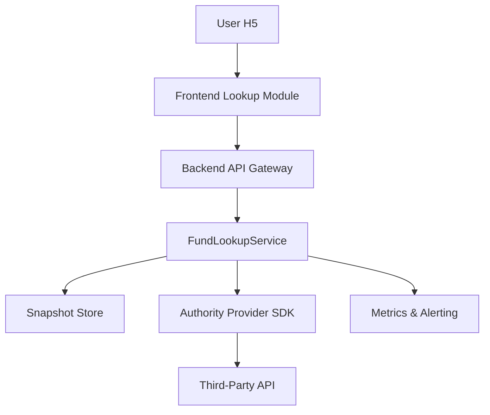

# Real Fund Data Integration

Feature Name: real-fund-data
Updated: 2026-02-01

## Description

该特性在现有猪猪养基架构上新增权威基金估值接入链路,包括前端基金搜索体验、后端 Lookup API、对第三方数据供应商的封装、缓存与监控,以满足实时估值展示与合规要求。

## Architecture



- **数据流**: 用户输入 -> 前端调用 Lookup API -> 后端命中缓存或调用 Authority Provider -> 返回估值数据 -> 前端渲染并轮询刷新。
- **控制流**: FundLookupService 负责供应商选择、降级、缓存管理与速率限制; Metrics 模块提供监控与告警数据。

## Components and Interfaces

- **Frontend Lookup Module**: 新增组合式组件,封装输入建议、结果卡片与轮询逻辑。通过 `GET /api/funds/search?q=` 与 `GET /api/funds/{code}/estimate` 接口交互。
- **Backend API Gateway**: Express 路由层,新增 `funds.search` 与 `funds.estimate` 控制器,统一 JWT 校验、入参校验与速率限制。
- **FundLookupService**: 核心服务层,提供 `searchFunds(query)` 与 `getEstimate(code)` 方法,内聚缓存控制、供应商调度、错误映射。
- **Authority Provider SDK**: 对第三方 API 的轻量适配器,实现签名、重试、字段映射,支持主备供应商配置热切换。
- **Snapshot Store**: 采用 Redis Hash/InfluxDB Measurement 存储估值快照,提供 10 秒 TTL、fund-code 维度的命中统计。
- **Metrics & Alerting**: 复用现有监控栈(如 Prometheus + Grafana),新增估值延迟、错误率、缓存命中率、用户限流等指标与告警规则。

## Data Models

```ts
type FundSuggestion = {
  code: string
  name: string
  provider: string
  lastUpdated: string
}

type FundEstimateSnapshot = {
  code: string
  nav: number
  estimateNav: number
  estimateChangePct: number
  provider: string
  receivedAt: string
  sourceTimestamp: string
  cacheTtlSeconds: number
  degraded: boolean
}

type ProviderConfig = {
  name: string
  baseUrl: string
  apiKey: string
  secret: string
  timeoutMs: number
  rateLimitPerMin: number
  signatureAlgo: 'sha256' | 'md5'
}
```

## Correctness Properties

- **P1 数据新鲜度**: `receivedAt - sourceTimestamp <= 300s`,否则结果标记为延迟并触发提示。
- **P2 缓存一致性**: 当 Snapshot Store 命中时返回的 `estimateNav` 必须对应相同 `sourceTimestamp`,避免旧值覆盖。
- **P3 安全性**: Lookup API 仅在校验通过的 JWT 会话下返回完整估值,否则降级为模糊提示。
- **P4 速率限制**: 对单用户与全局供应商调用分别施加限流阈值,避免触发第三方封禁。

## Error Handling

- **供应商故障**: 捕获 HTTP 超时、非 2xx 响应,自动切换备用供应商并附带 `degraded=true` 字段。
- **数据校验失败**: 记录结构化错误日志、上报告警,对前端返回可读错误码 `FUND_DATA_INVALID`。
- **缓存不可用**: 直接透传实时数据并在响应头加入 `X-Cache-Status: bypass`,同时触发 Snapshot Store 告警。
- **限流触发**: 返回 429 与 `retryAfter` 秒数,并记录用户 ID、基金代码帮助定位刷接口行为。

## Test Strategy

- **Unit Tests**: 覆盖 FundLookupService 供应商切换、数据校验、缓存读写与限流逻辑; Authority Provider SDK 的签名与错误映射。
- **Integration Tests**: 使用 Mock Server 模拟主备供应商,验证超时切换与降级响应; 通过 Redis Test Container 验证缓存 TTL 与命中策略。
- **Contract Tests**: 前后端共同维护接口契约 (e.g. JSON Schema),确保字段含义一致; 在 CI 中用示例载荷校验。
- **Performance Tests**: 以 200 req/s 压测 Lookup API,验证平均延迟 < 300ms、P95 < 600ms,并检查缓存与限流策略有效性。
- **Monitoring Verification**: 通过故障演练触发超时、错误率与限流,确认告警链路可用。

## References

- README.md: 项目总体结构、技术栈与运行方式。
